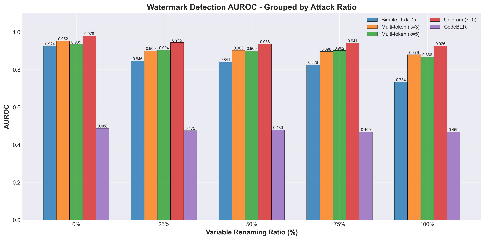

# SWEET Watermark 改良方案實作指南

## 實驗結果總覽



*圖：不同浮水印方法在變數重命名攻擊下的 AUROC 表現比較*

---

## 專案概述

### 研究目標

基於 SWEET watermark 系統，探討不同 seeding scheme 對程式碼浮水印效能的影響。

### 實驗設定

- **Model**: bigcode/starcoderbase-7b
- **Task**: HumanEval (164 problems)
- **參數**: gamma=0.25, delta=3.0, entropy_threshold=1.2
- **評估指標**:
  - AUROC: 整體區分能力
  - TPR@0%: 零誤報率下的真陽性率（最嚴格）
  - TPR@1%: 1% 誤報率下的真陽性率
  - TPR@5%: 5% 誤報率下的真陽性率（較寬鬆）

---

## 新增方法的標準流程

### 步驟 1: 理論設計

確定方法的核心概念：
- 如何從 context tokens 生成 seed
- 需要多長的 context window (k)
- 與 SWEET framework 的兼容性

### 步驟 2: 程式碼修改

需要修改 5 個位置：

1. **main.py**: 在 `--seeding_scheme` 的 choices 中加入新方法名稱
2. **watermark.py (_seed_rng)**: 實作 seed 生成邏輯
3. **watermark.py (WatermarkDetector.__init__)**: 設定 `min_prefix_len`
4. **generation.py**: 傳遞 seeding_scheme 參數
5. **evaluator.py**: 傳遞 seeding_scheme 參數

### 步驟 3: 創建執行腳本

每個方法需要 3 個 shell scripts：

```
scripts/main/{method}_run_sweet_generation.sh        # 生成帶浮水印的程式碼
scripts/main/{method}_run_sweet_detection.sh         # 檢測機器生成的程式碼
scripts/main/{method}_run_sweet_detection_human.sh   # 測試人類程式碼的誤報率
```

腳本主要參數：
- `--outputs_dir OUTPUT_{METHOD}`: 輸出目錄
- `--seeding_scheme {method}`: 指定方法

### 步驟 4: 執行實驗

完整流程（約 2-3 小時）：

```bash
bash scripts/main/{method}_run_sweet_generation.sh && \
bash scripts/main/{method}_run_sweet_detection.sh && \
bash scripts/main/{method}_run_sweet_detection_human.sh && \
python calculate_auroc_tpr.py \
    --task humaneval \
    --human_fname OUTPUT_{METHOD}_HUMAN/evaluation_results.json \
    --machine_fname OUTPUT_{METHOD}/evaluation_results.json
```

---

## 各方法實作與結果

### Method 1: Simple_1 (Baseline)

#### 論文依據

Kirchenbauer et al., "A Watermark for Large Language Models" (NeurIPS 2023)

#### 核心概念

使用單一前置 token 生成 seed：
- Context window: k=1
- Seed = hash(previous_token) × hash_key
- 最簡單的 baseline 方法

#### 執行方式

**Scripts 命名:**
- `run_sweet_generation.sh`
- `run_sweet_detection.sh`
- `run_sweet_detection_human.sh`

**輸出目錄:** `OUTPUT_DIRECTORY`

**執行指令:**
```bash
bash scripts/main/run_sweet_generation.sh && \
bash scripts/main/run_sweet_detection.sh && \
bash scripts/main/run_sweet_detection_human.sh && \
python calculate_auroc_tpr.py \
    --task humaneval \
    --human_fname OUTPUT_DIRECTORY_HUMAN/evaluation_results.json \
    --machine_fname OUTPUT_DIRECTORY/evaluation_results.json
```

#### 實驗結果

```
AUROC: 0.9242
TPR@0%: 0.5671
TPR@1%: 0.6402
TPR@5%: 0.7012
```

**註：** 如果照著原 github 的 gamma、delta、entropy threshold => 0.608；改成現在這個版本 => 0.828

#### 結果分析

作為 baseline 表現尚可，AUROC 超過 0.92。優點是實作最簡單、計算最快，TPR@0% 達到 0.567 在嚴格檢測下表現相對較好。缺點是只依賴單一 token，容易被攻擊，修改任何一個 token 都會完全改變後續的 green list。

根據 Zhao et al. (2024)，k=1 方法的理論衰減係數為 2.125，在受到編輯攻擊時 z-score 降幅較大。適合快速原型開發和不需要高度抵抗攻擊的應用。

---

### Method 2: Multi-token (k=3)

#### 論文依據

Zhao et al., "Provable Robust Watermarking for AI-Generated Text" (ICLR 2024)

#### 核心概念

使用 rolling hash 結合最後 3 個 tokens：
- Context window: k=3
- 使用 prime multiplier (31) 確保良好的 hash 分布
- 每個 token 都對最終 seed 有貢獻

#### 執行方式

**Scripts 命名:**
- `multitoken_run_sweet_generation.sh`
- `multitoken_run_sweet_detection.sh`
- `multitoken_run_sweet_detection_human.sh`

**輸出目錄:** `OUTPUT_MULTITOKEN`

#### 實驗結果

```
AUROC: 0.9516
TPR@0%: 0.4939
TPR@1%: 0.4939
TPR@5%: 0.7622
```

#### 結果分析

AUROC 顯著提升到 0.952，在 k-gram 方法中表現最佳。相比 Simple_1，AUROC 提升 2.8%，但 TPR@0% 下降到 0.494，TPR@5% 提升到 0.762。

有趣的發現是 TPR@0% 和 TPR@1% 完全相同，說明檢測 threshold 有明確的"階梯效應"。優勢是對單一 token 修改更魯棒，需要連續改動 3 個 token 才能破壞浮水印。劣勢是 3-token dependency 增加了邊界情況複雜度，在嚴格 threshold 下容易誤判。

雖然理論衰減係數與 k=1 相同（2.125），但因為需要連續修改多個 token，有效編輯次數降低，整體魯棒性提升。適合需要平衡 detection accuracy 和 robustness 的場景。

---

### Method 3: Unigram

#### 論文依據

Zhao et al., "Provable Robust Watermarking for AI-Generated Text" (ICLR 2024)

#### 核心概念

完全不依賴 context，使用固定的 global green list：
- Context window: k=0
- Seed = hash_key（固定值）
- 所有位置使用相同的 green list

#### 執行方式

**Scripts 命名:**
- `unigram_run_sweet_generation.sh`
- `unigram_run_sweet_detection.sh`
- `unigram_run_sweet_detection_human.sh`

**輸出目錄:** `OUTPUT_UNIGRAM`

#### 實驗結果

```
AUROC: 0.9789
TPR@0%: 0.7195
TPR@1%: 0.7256
TPR@5%: 0.9146
```

#### 結果分析

所有指標都是最佳，AUROC 接近 0.98，是明確的贏家。AUROC 比 Multi-token 高 2.7%，TPR@0% 高達 0.720，TPR@5% 超過 0.91。

理論上 unigram 應該因為沒有利用 context 資訊而表現較差，但實驗結果完全相反。可能原因包括：(1) 固定 green list 讓每個 token 決策獨立，減少累積誤差，variance 估計更準確；(2) SWEET 只在高 entropy 位置加浮水印，固定 green list 不會過度限制語義表達；(3) 程式碼生成中很多 token 選擇是獨立的，不需要複雜的 context dependency；(4) 沒有邊界情況複雜度，檢測更穩定。

理論衰減係數只有 1.125，遠低於 k-gram 的 2.125，在相同攻擊下 z-score 下降幅度只有 k-gram 的 53%。計算最快，不需要 hash context。潛在風險是如果 hash_key 洩漏，攻擊者可以完全避開 green list。

Zhao et al. 的論文主要分析 attack robustness，但我們的實驗是 normal detection。在 normal 情況下，unigram 的簡單性反而成為優勢。適合追求最高 detection accuracy 和需要最快推理速度的場景。

---

### Method 4: CodeBERT

#### 論文依據

Feng et al., "CodeBERT: A Pre-Trained Model for Programming and Natural Languages" (EMNLP 2020)

#### 核心概念

使用語義 embedding 來生成 seed：
- Context window: k=10 tokens
- 將 context 透過 CodeBERT 編碼成 768 維 embedding
- 對 embedding 進行 hash 得到 seed

#### 執行方式

**Scripts 命名:**
- `codebert_run_sweet_generation.sh`
- `codebert_run_sweet_detection.sh`
- `codebert_run_sweet_detection_human.sh`

**輸出目錄:** `OUTPUT_CODEBERT`

#### 實驗結果

```
AUROC: 0.4880
TPR@0%: 0.0000
TPR@1%: 0.0122
TPR@5%: 0.0549
```

#### 結果分析

完全失敗。AUROC = 0.488 < 0.5（比隨機猜測還差），TPR@0% = 0（完全無法檢測），所有指標都遠低於其他方法。

失敗的根本原因是浮點數數值不穩定。核心假設是 generation 和 detection 時相同 context 應該產生相同 embedding 和 seed，但實際上：(1) GPU 浮點運算有微小誤差，即使 embedding 只差 1e-8，經過 hash 後 seed 也會完全不同；(2) Hash function 的 avalanche effect 使輸入微小變化導致輸出巨大變化；(3) GPU vs CPU 的浮點運算結果有差異；(4) StarCoder 和 CodeBERT 的 tokenizer 雙重轉換導致資訊損失；(5) Mean pooling 累積誤差。

AUROC < 0.5 表示模型在"反向"檢測浮水印。Generation 時的 seed_A 產生 green_list_A，但 Detection 時因浮點誤差產生不同的 seed_B 和 green_list_B，導致 z-score 偏低，形成負相關。

可能的解決方案包括量化 embedding、只用 [CLS] token、減少 context size、嚴格控制計算環境等，但都未實作。執行時間比其他方法慢 20-50%。

這個失敗是技術實作問題而非理論問題。學術價值在於說明語義方法在 watermarking 中的實作挑戰，提醒研究者注意浮點數精度對 hash-based 方法的影響。考慮到 unigram 已達到 0.979 的 AUROC，建議將此作為負面案例保留在論文中。目前不適用於任何場景。

---

### Method 5: Multitoken5 (k=5)

#### 論文依據

Zhao et al., "Provable Robust Watermarking for AI-Generated Text" (ICLR 2024)

#### 核心概念

Multi-token 的擴展版本：
- Context window: k=5
- Rolling hash 結合最後 5 個 tokens
- 理論上應該更難攻擊

#### 執行方式

**Scripts 命名:**
- `multitoken5_run_sweet_generation.sh`
- `multitoken5_run_sweet_detection.sh`
- `multitoken5_run_sweet_detection_human.sh`

**輸出目錄:** `OUTPUT_MULTITOKEN5`

#### 實驗結果

```
AUROC: 0.9347
TPR@0%: 0.2927
TPR@1%: 0.6463
TPR@5%: 0.8232
```

#### 結果分析

表現介於 Simple_1 和 Multi-token 之間，展現有趣的 trade-off。AUROC (0.935) 反而低於 k=3 (0.952)，不符合「k 越大越好」的直覺。TPR@0% 只有 0.293 是所有方法中最低，但 TPR@1% (0.646) 比 k=3 提升 31%，TPR@5% (0.823) 比 k=3 提升 8%。

Context Length 的 Trade-off：正面效應是更長的 context 使攻擊者需要修改更多 tokens，對局部編輯更魯棒，解釋了 TPR@5% 的優異表現。負面效應是每個位置的 green list 強烈依賴前 5 個 tokens，prefix 微小變化導致完全不同的 green list，增加邊界情況複雜度，解釋了 TPR@0% 的顯著下降。

TPR 模式（0.293 → 0.646 → 0.823）說明 k=5 的 z-score 分布有較大 variance，大量真正的 watermark samples 落在臨界區域，在 FPR=0% 時被錯過但在 FPR=1% 時被捕捉。相比之下，k=3 的 TPR@0% = TPR@1%，z-score 分布較為"二元化"。

雖然 k=3 和 k=5 的理論衰減係數相同（2.125），但更大的 k 需要更多有效編輯才能破壞 watermark，解釋了在 attack scenario 下 k=5 應該更魯棒。但在 normal detection 時，更大的 k 增加檢測難度，解釋了 TPR@0% 下降。

適合可容忍 1-5% false positive、面對局部編輯攻擊的場景。不適合需要零誤報或追求最高 AUROC 的場景。這個結果展示了嚴格檢測和容錯檢測之間的權衡，選擇 context window 大小應根據應用場景的誤報容忍度決定。

---

## Variable Renaming Attack

用於測試水印檢測的魯棒性，通過重命名程式碼中的變數名稱來攻擊水印。

### 使用方式

```bash
# 基本用法
python rename_attack.py -i generations.json

# 指定參數
python rename_attack.py -i generations.json -s sequential -r 0.5

# 完整參數範例
python rename_attack.py --input ./OUTPUT_DIRECTORY/generations.json --strategy random --ratio 0.75 --seed 123
```

### 參數說明

| 參數 | 簡寫 | 說明 | 預設值 |
|------|------|------|--------|
| `--input` | `-i` | 輸入 JSON 檔案路徑 | (必須) |
| `--output` | `-o` | 輸出 JSON 檔案路徑 | 自動生成 |
| `--strategy` | `-s` | 重命名策略 (`random`, `sequential`, `obfuscate`) | `sequential` |
| `--ratio` | `-r` | 重命名比例 (0.0-1.0) | `1.0` |
| `--seed` | | 隨機種子 | `42` |

### 重命名策略

- **`random`**: 隨機生成 8 個小寫字母作為變數名
- **`sequential`**: 使用 `var_1`, `var_2`, ... 依序命名
- **`obfuscate`**: 使用 `_xxxx_1` 格式的混淆命名

### 自動輸出路徑

當不指定 `--output` 時，會自動根據輸入檔名、策略和比例生成輸出路徑：
- `generations.json` + `sequential` + `0.5` → `generations_renamed_sequential_50.json`

### 比例參數 (ratio)

- `ratio=1.0`: 重命名所有變數（預設）
- `ratio=0.5`: 隨機選擇 50% 的變數重命名
- `ratio=0.0`: 不重命名任何變數

---

## 批次攻擊測試

### run_test.sh - 自動化測試腳本

用於批次測試所有方法在不同重命名比例下的魯棒性。

#### 功能特點

- **多方法測試**: 自動遍歷所有浮水印方法（Simple_1, Multi-token, Unigram 等）
- **多比例攻擊**: 測試 0%, 25%, 50%, 75%, 100% 五種重命名比例
- **完整流程**: 自動執行重命名攻擊 → 浮水印檢測 → 計算 AUROC/TPR
- **結果彙總**: 自動生成所有測試結果的摘要

#### 使用方式

```bash
# 執行完整測試（預設測試所有方法）
./run_test.sh

# 或使用 bash
bash run_test.sh
```

#### 配置參數

編輯 `run_test.sh` 來自訂測試範圍：

```bash
# 選擇要測試的方法
METHODS=("DIRECTORY" "MULTITOKEN" "MULTITOKEN5" "UNIGRAM" "CODEBERT")

# 選擇測試的重命名比例
RATIOS=(0.0 0.25 0.5 0.75 1.0)

# 選擇重命名策略
STRATEGY="sequential"  # 可選: random, sequential, obfuscate, default
```

#### 輸出結果

每個測試組合會產生：
- `OUTPUT_{METHOD}_RENAMED_{RATIO}/generations_renamed_*.json` - 重命名後的代碼
- `OUTPUT_{METHOD}_RENAMED_{RATIO}/evaluation_results.json` - 檢測結果
- `OUTPUT_{METHOD}_RENAMED_{RATIO}/metrics.txt` - AUROC 和 TPR 指標

#### 執行時間

- 單一方法單一比例：約 15-20 分鐘
- 單一方法全部比例 (5個)：約 1.5-2 小時
- 全部方法全部比例 (5×5=25個)：約 8-10 小時

#### 範例輸出

```
==========================================
Processing METHOD: MULTITOKEN5
==========================================

------------------------------------------
Testing ratio: 0.5 (50% renaming)
------------------------------------------
[1/3] Performing rename attack...
[2/3] Running watermark detection...
[3/3] Calculating AUROC and TPR...
--- Metrics ---
0.8523
0.3145
0.5234
0.7456
---------------
```

---

## 結果視覺化

### show.sh - 自動生成圖表

用於將所有實驗結果視覺化成專業圖表。

#### 功能特點

- **6 種圖表**: AUROC、TPR@0%、TPR@5%、熱力圖、相對降解、全指標對比
- **自動收集數據**: 從所有 `OUTPUT_*_RENAMED_*/metrics.txt` 讀取結果
- **高品質輸出**: 300 DPI 高解析度 PNG 圖片
- **CSV 匯出**: 生成可供 Excel 分析的數據表格
- **文字摘要**: 在終端機顯示完整結果表格

#### 使用方式

```bash
# 生成所有圖表
./show.sh

# 或使用 bash
bash show.sh
```

#### 生成的圖表

1. **auroc_vs_ratio.png** - AUROC 隨攻擊比例變化曲線圖
   - X軸: 變數重命名比例 (0%-100%)
   - Y軸: AUROC 值
   - 顯示各方法的魯棒性趨勢

2. **tpr0_vs_ratio.png** - TPR@0%FPR 隨攻擊比例變化
   - 最嚴格檢測標準下的表現
   - 適合評估零誤報場景

3. **tpr5_vs_ratio.png** - TPR@5%FPR 隨攻擊比例變化
   - 較寬鬆檢測標準下的表現
   - 適合評估實際應用場景

4. **all_metrics.png** - 2×2 子圖顯示所有指標
   - 一次查看 AUROC、TPR@0%、TPR@1%、TPR@5%
   - 適合論文投稿或報告使用

5. **auroc_heatmap.png** - AUROC 熱力圖
   - 行: 浮水印方法
   - 列: 攻擊比例
   - 顏色: AUROC 值（綠色高，紅色低）

6. **auroc_degradation.png** - 相對性能降解
   - 顯示相對於基準的降解百分比
   - 適合比較不同方法的魯棒性

#### 輸出位置

所有圖表儲存在 `plots/` 目錄：
```
plots/
├── auroc_vs_ratio.png
├── tpr0_vs_ratio.png
├── tpr5_vs_ratio.png
├── all_metrics.png
├── auroc_heatmap.png
├── auroc_degradation.png
└── results_summary.csv
```

#### 範例輸出（終端機）

```
================================================================================
SUMMARY TABLE
================================================================================
Method               Ratio    AUROC      TPR@0%     TPR@1%     TPR@5%    
--------------------------------------------------------------------------------
Simple_1 (k=1)         0%     0.9242     0.5671     0.6402     0.7012    
Simple_1 (k=1)        25%     0.8856     0.4512     0.5890     0.6543    
Simple_1 (k=1)        50%     0.8234     0.3456     0.4789     0.5876    
...
--------------------------------------------------------------------------------

Saved: plots/auroc_vs_ratio.png
Saved: plots/tpr0_vs_ratio.png
Saved: plots/all_metrics.png
...

All plots generated successfully!
```

#### 查看圖表

```bash
# Linux with eog (Eye of GNOME)
eog plots/*.png

# 或使用其他圖片檢視器
display plots/auroc_vs_ratio.png    # ImageMagick
feh plots/                           # feh
```

#### CSV 數據格式

`plots/results_summary.csv` 內容範例：
```csv
Method,Ratio,AUROC,TPR@0%,TPR@1%,TPR@5%
Simple_1 (k=1),0,0.924200,0.567100,0.640200,0.701200
Simple_1 (k=1),25,0.885600,0.451200,0.589000,0.654300
Multi-token (k=3),0,0.951600,0.493900,0.493900,0.762200
...
```

---

## 完整實驗流程

### 從零開始的完整指南

```bash
# 1. 環境設定
conda env create -f environment.yml
conda activate sweet

# 2. 執行各方法的基準測試（無攻擊）
bash scripts/main/run_sweet_generation.sh
bash scripts/main/run_sweet_detection.sh
bash scripts/main/run_sweet_detection_human.sh

bash scripts/main/multitoken_run_sweet_generation.sh
bash scripts/main/multitoken_run_sweet_detection.sh
bash scripts/main/multitoken_run_sweet_detection_human.sh

# ... 其他方法類似

# 3. 執行變數重命名攻擊測試
./run_test.sh

# 4. 生成視覺化圖表
./show.sh

# 5. 查看結果
cat plots/results_summary.csv
eog plots/*.png
```

### 快速測試（僅測試單一方法）

```bash
./run_test.sh
./show.sh
```
